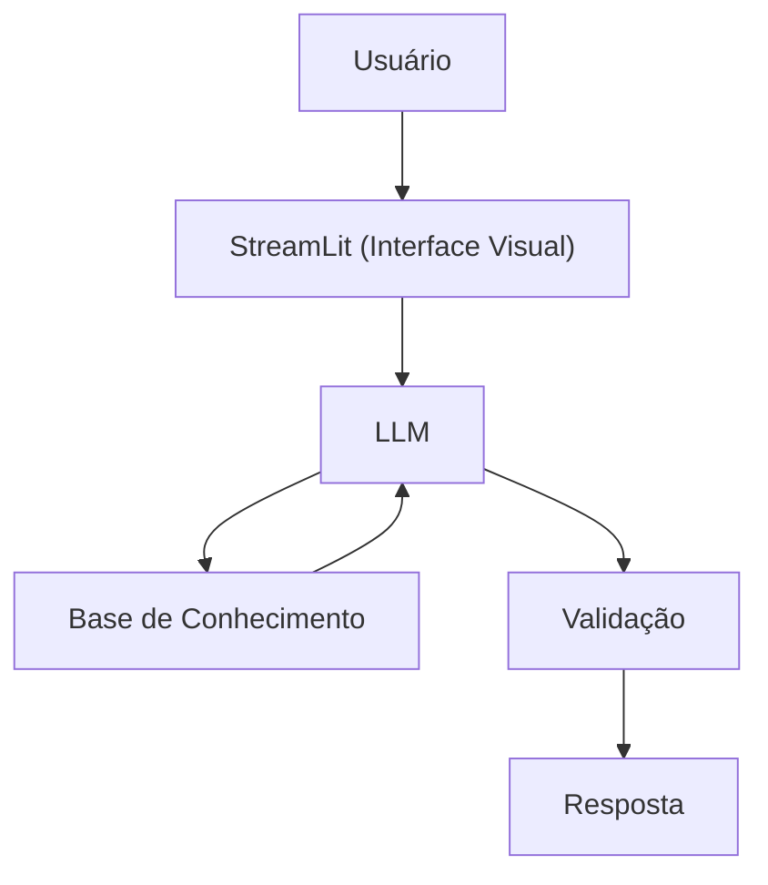

# Documentação do Agente

## Caso de Uso

### Problema
> Qual problema financeiro seu agente resolve?

Vai alertar sobre os gastos da pessoa

### Solução
> Como o agente resolve esse problema de forma proativa?

Com base no histórico de gastos e contas a pagar, o agente projeta como o saldo estará no final do mês e envia recomendações de contenção de despesas de forma antecipada.

### Público-Alvo
> Quem vai usar esse agente?

No começo minha família

---

## Persona e Tom de Voz

### Nome do Agente
Mauboto

### Personalidade
> Como o agente se comporta? (ex: consultivo, direto, educativo)

Direto, prático, levemente humorado e focado em soluções rápidas.

### Tom de Comunicação
> Formal, informal, técnico, acessível?

Informal

### Exemplos de Linguagem
- Saudação: [ex: "Olá! Como posso ajudar com a nossa projeção de saldo?"]
- Confirmação: [ex: "Entendi! Registro feito e saldo projetado ajustado"]
- Erro/Limitação: [ex: "Ainda não tenho essa função. No momento, meu foco é apenas calcular e projetar o nosso saldo."]

---

## Arquitetura

### Diagrama

### Componentes

| Componente | Descrição |
|------------|-----------|
| Interface | [Streamlit](https://streamlit.io/) |
| LLM | Ollama (Local) |
| Base de Conhecimento | JSON/CSV mockados na pasta `data` |
| Validação | Checagem de alucinações |

---

## Segurança e Anti-Alucinação

### Estratégias Adotadas

- [ ] Só responde com base nos dados fornecidos
- [ ] Avisa quando algo está muito caro (mais de 10% da renda da pessoa)
- [ ] Admitir quando não sabe
- [ ] Faz recomendações de controle de gastos
- [ ] Transparência nos cálculos(exibir um resumo rápido)
- [ ] Solicitar dados exatos
- [ ] Deixar sempre muito claro na mensagem o que é o saldo real atual e o que é a projeção futura
- [ ] Só considera receitas fixas e confirmadas para a previsão

### Limitações Declaradas
> O que o agente NÃO faz?

- Não substitui um profissional certificado
- Não realiza transações financeiras
- Não garante precisão absoluta no futuro
- Não fornece dicas de investimentos
- Não resolve questões tributárias
